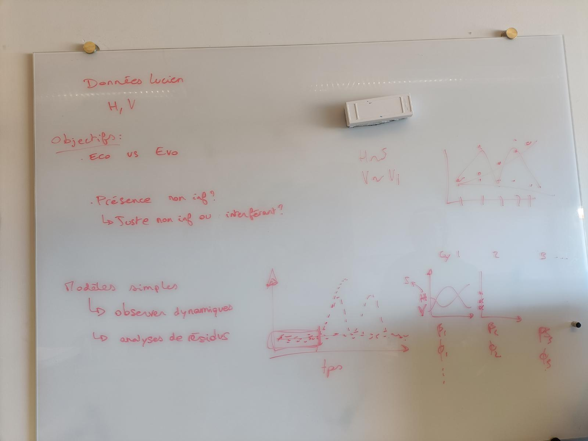
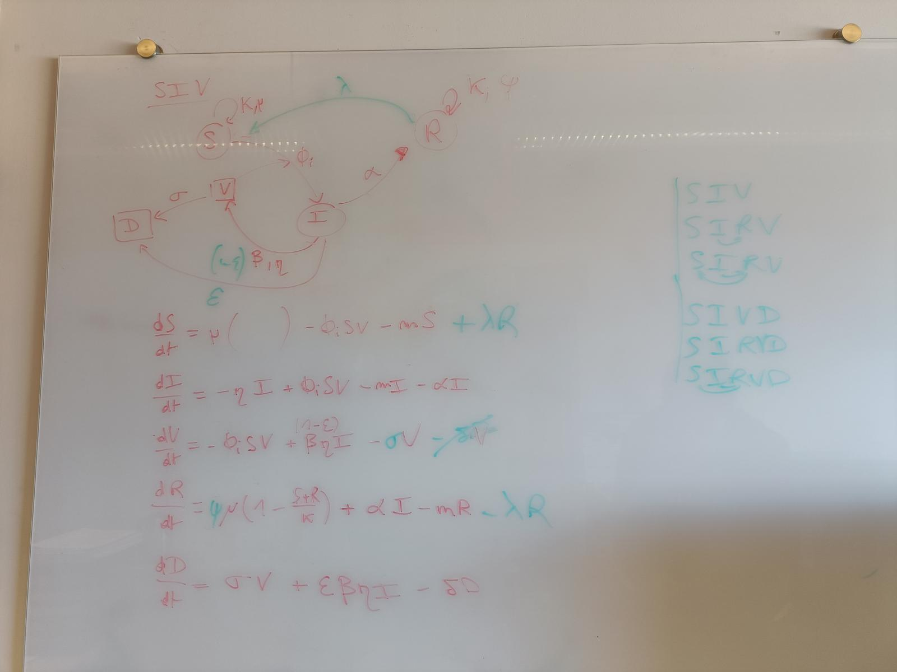
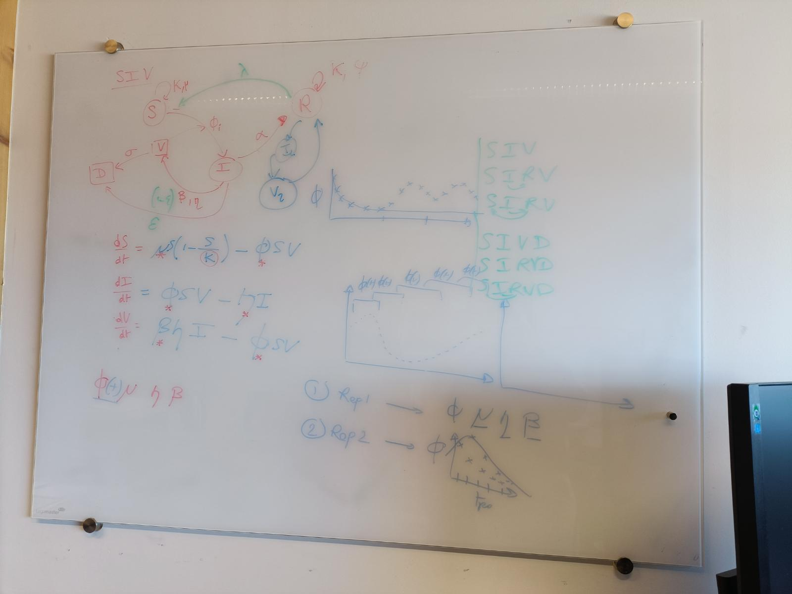
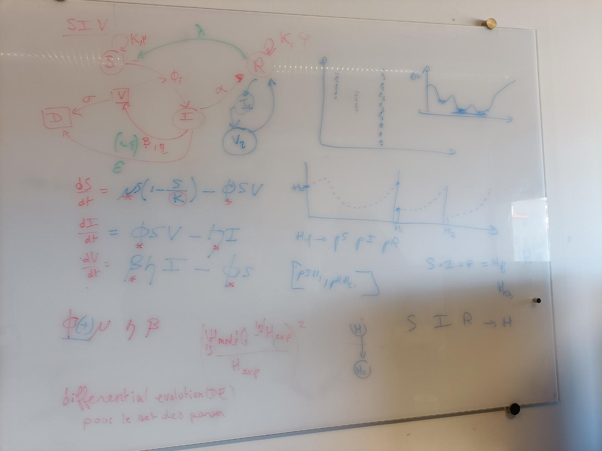

# ===== 03/04/26 =====

# Meeting David and Lou

[Objectives of the week](photos/Meeting_030426_DD_LD/IMG20260403152539.jpg)
* Nettoyage code
* Variabilité param
* SIV :
    * Voir fits pour au moins 100 sets de fit pour voir variabilité
    * Résidus(t) pour au moins 100 sets de fit pour voir variabilité
    * phi(t) pour chaque réplicat successivement (ppour cycle 1 au moins), tracer phi et I/I+S en fonction du temps

Next meeting : 10/04/26 2pm

# Communication & Organisation
Share the GitHub with David
    * Github branches "modelo" (and "bioinfo")
    * Two readme files :
        README.md : presents the current architecture
        README_day_to_day.md : what is done each day

# Clean code
[text](030426_code_optimise_simulate_[fit-plot-model].jl)
    * Optimization function : no modification needed, exponential applied on model values before calculating the error :
        Vpred = exp(u[4]) + exp(u[5]) + exp(u[6])
        err += (Vpred * Vobs)^2 / max(Vobs^2, 1e*12)
    * Suppress old folders and files, keep interesting codes in old_codes/
    * Change SIRVi_SR into SIRVi_IR
    * clean output
        * add H, V xp legend
        * create log file
        * automize the name of output files
    * change models : remove max(1e-6)
    * code dilution

# Further code
[text](040426_code_test_parameters_variability.jl)
    * Study variability with differential evolution

[text](080426_code_phi_deux.jl)
[text](080426_code_phi_deux_variable.jl)
    * Two phi for the first cycle

# ===== 14/04/26 =====
[text](100426_code_phi(t)_cycle1.jl)

[text](140426_code_phi(t)_cycles12345_keep_phi.jl)

[text](140426_code_phi(t)_cycles12345_2.jl)

Procédure générale :

K fixé

Premier cycle :
- Fit initial de tous les paramètres (mu, eta, phi, …)
- Calcul et plot du résidu
- Threshold du résidu défini à la main pour que ça coupe là où je veux (pas terrible mais je n’arrive pas à automatiser, tous les thresholds sont vachement différents, il faut que je réfléchisse)
- Fit itératif des phi suivants, avec thresholds et bornes ajustés à la main

Cycles suivants :
- Récupération du dernier phi
- Ajustement de ce phi dans des bornes (c’est là que je joue pour l’obliger à changer)
- Fit itératif comme le premier cycle

Donc dans le cas « je commence le cycle avec le dernier phi » :
Bornes d’ajustement très larges pour ne pas modifier le dernier phi

Dans le cas « j’autorise phi à changer dès le début du cycle » :
C’est plutôt je le force à changer en l’obligeant à prendre la valeur de la borne minimale de mon ajustement

C’était juste un premier test, pas très propre encore